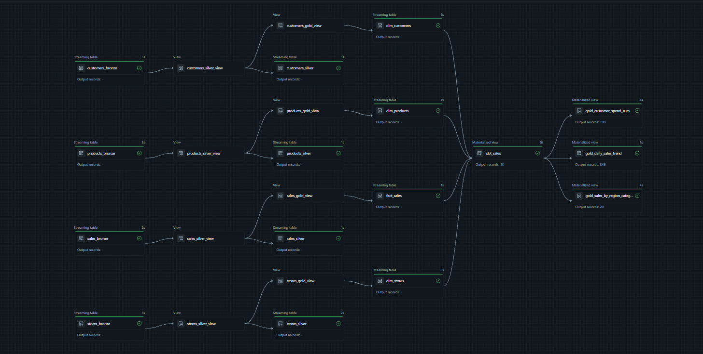
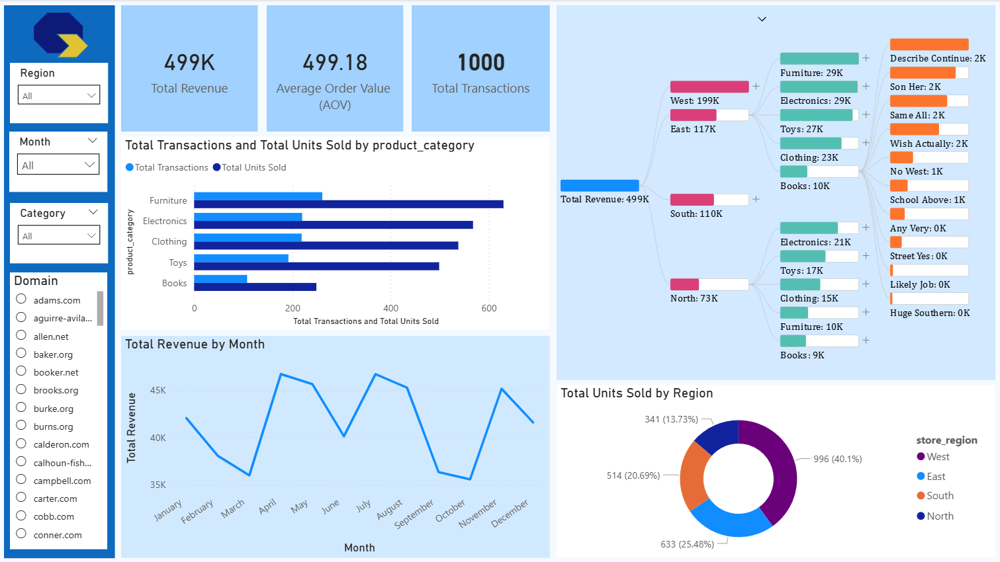

# Retail Analytics Data Pipeline: End-to-End Medallion Architecture

## Table of Contents
- [Project Overview](#project-overview)
- [Technologies Used](#technologies-used)
- [Architecture & Data Flow (Code Deep-Dive)](#architecture--data-flow-code-deep-dive)
  - [Bronze Layer (Ingestion)](#bronze-layer-ingestion)
  - [Silver Layer (Cleansing & CDC)](#silver-layer-cleansing--cdc)
  - [Gold Layer (Dimensional Modeling)](#gold-layer-dimensional-modeling)
  - [Serving Layer (OBT & Aggregations)](#serving-layer-obt--aggregations)
- [Data Modeling Methodology](#data-modeling-methodology)
- [Business Intelligence Dashboard](#business-intelligence-dashboard)
- [Repository Structure](#repository-structure)
- [Setup & Reproduction Instructions](#setup--reproduction-instructions)

## Project Overview

This repository contains a portfolio project demonstrating an end-to-end data engineering pipeline built using the Medallion architecture. The project is a retail data analytics platform designed to ingest raw retail data, process it through intermediate refinement layers utilizing Databricks Delta Live Tables (DLT), and serve the modeled data to a Power BI dashboard for actionable business intelligence.

## Technologies Used

- **Compute & Processing:** Databricks (Community Edition), PySpark, Delta Live Tables (DLT)
- **Ingestion:** Databricks Auto Loader (`cloudFiles`)
- **Storage:** Delta Lake (Databricks Volumes)
- **BI & Visualization:** Power BI, DAX

## Architecture & Data Flow (Code Deep-Dive)



The data pipeline adopts a robust Medallion Architecture, structured incrementally to ensure data quality, reliability, and performance.

### Bronze Layer (Ingestion)
The Bronze layer is responsible for the raw data ingestion phase. Raw CSV files containing organizational data (customers, products, stores, and sales) are continuously ingested from a Databricks Volume path (`/Volumes/databricksavi/bronze/bronze_volume/`). 

The pipeline utilizes Databricks Auto Loader (`cloudFiles`) to efficiently process new files as they arrive. For example, the `sales` data ingestion leverages PySpark's structured streaming:
```python
@dlt.table(name='sales_bronze')
def sales_bronze():
    return spark.readStream.format("cloudFiles") \
        .option("cloudFiles.format","csv") \
        .load("/Volumes/databricksavi/bronze/bronze_volume/sales/")
```
This stage preserves the data in its original, unmodified state, acting as an immutable system of record.

### Silver Layer (Cleansing & CDC)
In the Silver layer, the raw data undergoes significant refinement, standardization, and Change Data Capture (CDC).
- **Cleansing & Derivations:** PySpark functions are used to clean and enrich data. In `customers_silver.py`, customer names are upper-cased and email domains are extracted. In `sales_silver.py`, a new feature `pricePerSale` is calculated:
  ```python
  # Extracting derived metrics and standardizing text
  df = df.withColumn("name", upper(col("name")))
  df = df.withColumn("domain", split(col("email"), "@")[1])
  df_sales = df_sales.withColumn("pricePerSale", round(col("total_amount")/col("quantity"), 2))
  df = df.withColumn("processDate", current_timestamp())
  ```
- **Change Data Capture (CDC):** CDC is systematically handled using the `dlt.create_auto_cdc_flow` API. The process uses `processDate` as the sequence key. Data is upserted cleanly applying SCD Type 1 to ensure that records are computationally deduplicated.
  ```python
  dlt.create_auto_cdc_flow(
      target='customers_silver',
      source='customers_silver_view',
      keys=['customer_id'],
      sequence_by=col('processDate'),
      stored_as_scd_type=1  # Applied similarly across Silver pipelines
  )
  ```

### Gold Layer (Dimensional Modeling)
The Gold layer models the cleansed data for business consumption, implementing historical tracking and dimension building.
- **Star Schema:** The architecture uses a classic Star Schema consisting of the core fact table `fact_sales` and associated dimension tables `dim_customers`, `dim_products`, and `dim_stores`.
- **SCD Implementations:** The Gold layer explicitly separates tables adopting SCD Type 1 vs SCD Type 2 handling. `fact_sales` executes SCD Type 1, while dimension tables like `dim_customers` store full historical state using SCD Type 2. 
  ```python
  # dim_customers retaining historical progression
  dlt.create_auto_cdc_flow(
      source='customers_gold_view',
      target='dim_customers',
      keys=['customer_id'],
      sequence_by=col('processDate'),
      stored_as_scd_type=2, 
      except_column_list=['processDate']
  )
  ```

### Serving Layer (OBT & Aggregations)
To optimize performance and simplify querying for downstream BI tools, an analytical serving layer is built directly atop the core Gold structure.
- **One-Big-Table (OBT):** A materialized OBT, `obt_sales`, denormalizes facts and dimensions via `left` joins, extracting precise attributes like `customer_email_domain`, `product_base_price`, and `pricePerSale`. This removes the need for complex multi-table joins on the BI side.
- **Specialized Gold Aggregation Views:** Highly refined reporting tables are created leveraging PySpark aggregate functions:
  - `gold_sales_by_region_category`: Focuses on grouping via `store_region` and `product_category` to uncover revenue by segment.
  - `gold_customer_spend_summary`: Aggregates the Recency, Frequency, and Monetary (RFM) components per `customer_id`, finding `lifetime_spend` and `last_purchase_date`.
  - `gold_daily_sales_trend`: Provides uninhibited daily grouped time-series `daily_revenue` aggregation.

## Data Modeling Methodology

The historical integrity and current state correctness are maintained through rigorous modeling strategies on the dimensions within the Gold code blocks:
- **SCD Type 1:** The `fact_sales` and `dim_products` tables employ SCD Type 1 to cleanly overwrite old data with newly updated values.
- **SCD Type 2:** The `dim_customers` and `dim_stores` tables adopt SCD Type 2 tracking, which preserves all historical changes natively inside Delta tables. This provides exact point-in-time accuracy for comprehensive analytical queries or slowly changing store hierarchy adjustments.

## Business Intelligence Dashboard



The served data is visualized using Microsoft Power BI. The dashboard emphasizes essential business metrics derived from DAX calculations and tailored visual components to facilitate decision-making. Core functionalities and measures include:
- **YTD Revenue:** Monitoring revenue performance through the current calendar year.
- **MoM Growth:** Spotting and evaluating business growth patterns month over month.
- **Core Visuals:** Interactive visualizations breaking down sales trends over time, spend aggregations across customer demographics, and margin comparisons across disparate retail channels.

## Repository Structure

```
.
├── src/
│   ├── transformations/
│   │   ├── bronze/     # Auto Loader ingestion logic utilizing cloudFiles
│   │   ├── silver/     # Cleansing, column derivations, and Silver CDC upserts
│   │   └── gold/       # Star Schema SCD logic, OBT generation, and Aggregation views
├── powerbi/            # Contains the .pbix dashboard file
├── assets/             # Images and diagrams
└── README.md           # Project documentation
```

## Setup & Reproduction Instructions

### Prerequisites
- A Databricks Community Edition account setup.
- Power BI Desktop installed locally.

### Databricks Pipeline Setup
1. Upload the raw CSV files locally to the designated Databricks Volume path (`/Volumes/databricksavi/bronze/bronze_volume/`).
2. Import the Python scripts located in the `/src/transformations/` directory to your Databricks Workspace.
3. Configure your Delta Live Tables pipeline to execute the target ingestion scripts sequentially: Bronze -> Silver -> Gold.
4. Run the pipeline to populate the tables and trigger the streaming updates.

### Power BI Integration (Community Edition Workaround)
Because Databricks Community Edition lacks support for Personal Access Tokens (PAT), the connection to Power BI requires a specific functional workaround using the generic Spark Connector:

1. In Power BI Desktop, initiate a connection via "Get Data" and search for **Spark**.
2. **Authentication:** Select Basic Authentication. Provide your Databricks Community Edition account email address and password as the credentials.
3. **HTTP Path details:** Ensure Power BI is routing the connection through the cluster's JDBC/ODBC HTTP Path, found within the Advanced Options of your active compute configuration.

**Crucial Note for Refreshing Data:** Databricks Community Edition clusters automatically terminate after a short period of inactivity. Users must ensure that the cluster is manually started and running successfully before attempting to refresh the Power BI dataset to avoid connection timeouts.
